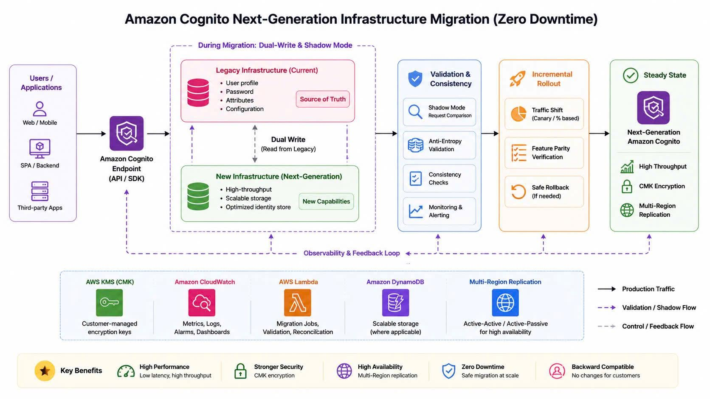

# HOW DID AWS UPGRADE AMAZON COGNITO SO THAT USERS BARELY NOTICED?

In modern systems, authentication is essentially the "front door" of the entire application. If the login system encounters an error for just a few minutes, users may be unable to access services, fail to reset passwords, or experience a complete disruption of their experience.

For large-scale identity systems like Amazon Cognito – which serves hundreds of millions of user profiles – changing the backend infrastructure is not as simple as deploying a new version. A minor change can cause downtime or affect the authentication behavior of applications.

Recently, AWS shared how Amazon Cognito was upgraded to a next-generation infrastructure, bringing many new capabilities such as high-throughput performance, customer-managed encryption keys, and multi-Region replication, all while users barely noticed any disruption.

What I find interesting is not just the new features, but also how AWS executed a large-scale migration with a zero downtime goal.

---

## What's new in Amazon Cognito?

After the architecture upgrade, Amazon Cognito unlocked several notable capabilities:

### 1. High-throughput performance

The new infrastructure allows Cognito to handle a larger volume of requests, supporting modern workloads with:

- Tens of millions of users in a single user pool.
- Thousands of transactions per second (TPS).
- Low latency to avoid impacting the login experience.

This is especially useful for systems with a large user base or those that need to scale authentication quickly.

### 2. Customer-managed keys (CMK)

Another notable change is the ability to use customer-managed encryption keys via AWS KMS. Instead of relying entirely on AWS-managed keys, enterprises can:

- Manage the encryption key lifecycle themselves.
- Have better control over data encrypted at-rest.
- Meet compliance and security requirements.

This is a highly crucial capability for enterprise systems or organizations with strict security requirements.

### 3. Multi-Region replication

AWS also added the ability to replicate user pools to other Regions, including:

- User profiles.
- Passwords.
- User attributes.
- Configurations.

If a Regional failure occurs, the authentication system can still continue to operate. In my opinion, this is a very valuable point because authentication is often one of those components that "cannot go down" in a system architecture.

---

## What changed in the architecture?

According to AWS, Cognito previously relied heavily on a centralized data store. This made data management simpler but slowed down the process of expanding new features. In the new architecture, Cognito is designed with the following principles:

- **Identity-first design:** Instead of trying to be a general-purpose storage system, the new infrastructure focuses precisely on the identity management problem. This makes the system more optimized for user authentication, identity operations, and scalability.
- **Backward compatibility:** A principle I find very sound is: _Infrastructure can change, but customer applications should not be affected_. AWS tries to keep all backend changes compatible with previous behavior to avoid breaking changes.
- **Avoid one-way doors:** The new architecture is designed to evolve gradually over time rather than relying on "point of no return" decisions. This makes it easier for AWS to expand new capabilities in the future.

---

## How did AWS migrate with virtually zero downtime?

This is perhaps the most interesting part of the blog. To migrate hundreds of millions of user profiles without affecting customers, AWS applied multiple parallel validation techniques:

- **Shadow mode validation:** AWS ran requests on both the legacy and new systems simultaneously, then compared the: _response structure, status code, and behavior_. If there were any abnormal differences, the system would detect them immediately before impacting production. What I find great here is that AWS didn't just test functionality, but also behavior consistency.
- **Dual-write architecture:** During the migration, every request was written to both the _legacy infrastructure_ and the _new infrastructure_. If writing to the new system failed, the request would still succeed in the legacy system. This ensured that customers were virtually unaffected.
- **Anti-entropy validation:** AWS also deployed a continuous data comparison mechanism between the two systems to detect discrepancies. If there was a divergence, the legacy system acted as the source of truth to reconcile the data. This is quite an interesting approach in distributed systems.
- **Incremental rollout & rollback:** Instead of migrating everything at once, AWS rolled out in phases and always maintained the ability to rollback if issues arose. This significantly reduced risks when changing infrastructure at a large scale.

---

## What I learned from this case

After reading the blog, the most valuable lesson to me isn't about Cognito or the new features, but rather AWS's mindset toward infrastructure modernization.

Usually, when talking about migration, we often think about **migrating as fast as possible**. However, with critical systems like authentication, what's more important is **migrating as safely as possible**.

Shadow mode, dual write, anti-entropy validation, and rollback capabilities show that AWS prioritizes step-by-step verification over a "big bang migration". In my opinion, this is a highly worthwhile mindset to adopt when working with production systems or services that have a massive impact on users.

---

## Conclusion

Amazon Cognito's transition to a next-generation infrastructure not only brings new capabilities like multi-Region replication, customer-managed keys, and high-throughput performance, but also demonstrates how AWS handles a large-scale migration problem with near-zero disruption.

It is also an intriguing example of how large-scale authentication systems can be modernized while ensuring backward compatibility for customers.

**References:**

- 🔗 **[AWS Blog: Amazon Cognito unlocks new capabilities...](https://aws.amazon.com/.../amazon-cognito-unlocks.../...)**
