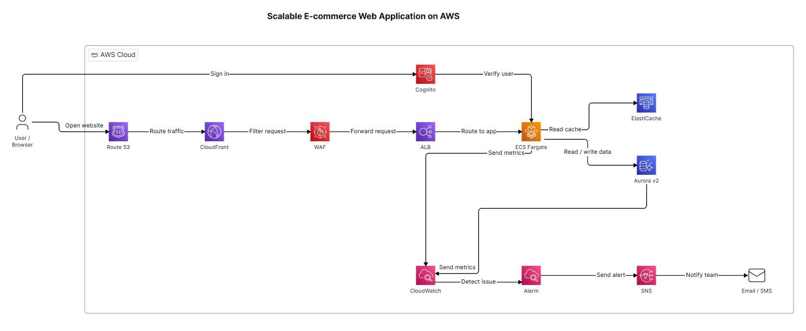

# SCALABLE E-COMMERCE WEBSITE ARCHITECTURE ON AWS

Hello everyone,

E-commerce websites often experience highly variable traffic, especially during promotions or peak shopping seasons. If all requests are handled by a single server and access the database directly, the system can easily become slow, overloaded, or disrupted.

A scalable architecture on AWS can be built following this flow:

**User → Route 53 → CloudFront → AWS WAF → Application Load Balancer → ECS Fargate → ElastiCache/Aurora**

### When a user accesses the website:

- **Amazon Route 53:** Routes requests to the system.
- **Amazon CloudFront:** Distributes content from locations close to users, helping to reduce latency.
- **AWS WAF:** Inspects and blocks requests with suspicious signs.
- **Application Load Balancer:** Distributes requests to Backend containers running on Amazon ECS with AWS Fargate.
- **Amazon Cognito:** Supports user registration, login, and authentication.
- **Amazon ElastiCache:** Temporarily stores frequently accessed data, helping to reduce the load on the database.
- **Amazon Aurora Serverless v2:** Stores primary data such as users, products, inventory, and orders.

Additionally, **Amazon CloudWatch** monitors the operations of ECS and Aurora. When it detects high CPU usage, numerous application errors, or abnormal database resource utilization, a CloudWatch Alarm triggers **Amazon SNS** to send alerts via email or SMS.

### Alert flow:

> **CloudWatch → CloudWatch Alarm → Amazon SNS → Email/SMS**

By combining these services, the website can accelerate access speed, improve security, reduce database load, scale flexibly, and detect issues early when user traffic spikes.

---

### References:

- 🔗 **[Guidance for Web Store on AWS](https://docs.aws.amazon.com/solutions/web-store-on-aws/)**
- 🔗 **[Guidance for Building a Containerized and Scalable Web Application on AWS](https://docs.aws.amazon.com/solutions/building-a-containerized-and-scalable-web-application-on-aws/)**
