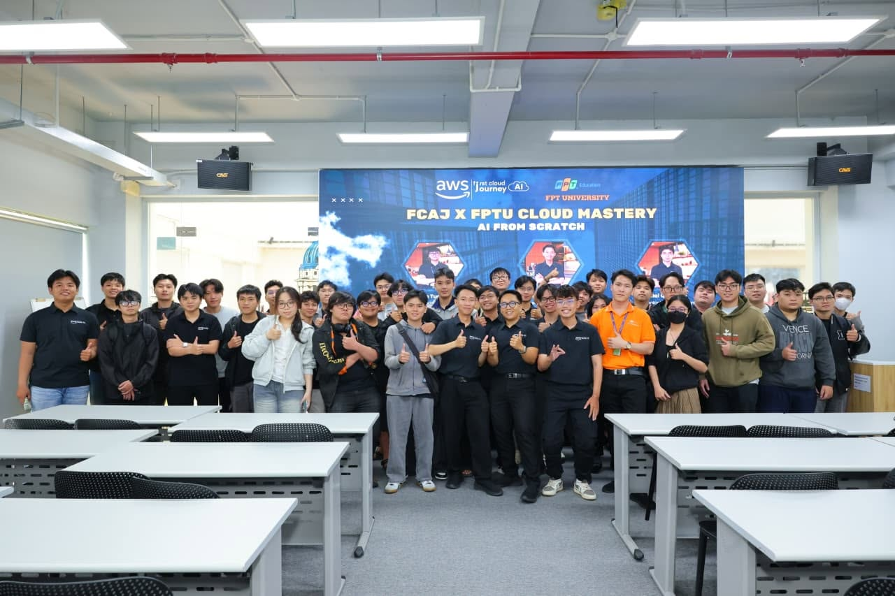

# sự kiện “FCAJ X FPTU CLOUD MASTERY: AI FROM SCRATCH”

### Mục Đích Của Sự Kiện
- Sự kiện này giúp mình tiếp cận với những nền tảng cơ bản nhất về Trí tuệ nhân tạo (AI) cũng như xu hướng Generative AI đang thịnh hành.
- Cung cấp cho mình góc nhìn rõ nét về cách tích hợp các dịch vụ AI của hệ sinh thái AWS vào những ứng dụng phần mềm hiện đại.
- Tạo cơ hội để mình lắng nghe những kinh nghiệm thực chiến từ các kỹ sư đi trước đang làm việc tại AWS.
- Kích thích tinh thần ham học hỏi của mình thông qua các màn demo công nghệ và các trò chơi tương tác thú vị.

### Danh Sách Diễn Giả
- **Nguyễn Công Minh** - DevOps Engineer, FCAJ AWS
- **Nguyễn Tuấn Thịnh** - DevSecOps Engineer, STYL Solution
- **Nguyễn Văn Duy Khiêm** - DevSecOps Engineer, STYL Solution
- **Huỳnh An Khương** - Full-stack Developer, VALSEA
- **Mai Quốc Anh** - Full-stack Developer

### Nội Dung Nổi Bật

#### Thay đổi cách tiếp cận với Trí tuệ nhân tạo

- Mình nhận thấy một điểm rất hay được đề cập là xu hướng ứng dụng AI hiện nay. Thay vì phải chật vật tự xây dựng hạ tầng, nền tảng điện toán đám mây đã cung cấp sẵn các dịch vụ quản lý toàn diện (Managed Services). Điều này giúp quá trình phát triển ứng dụng của mình trở nên nhẹ nhàng và tối ưu hơn rất nhiều.

### Xây dựng một AI Agent đa ngôn ngữ hoàn chỉnh
Sự kiện đã giúp mình "sáng mắt ra" thông qua ví dụ cụ thể về việc tạo ra một Customer Support Agent bằng quy trình 6 bước liên tục, minh họa cho việc lắp ghép các dịch vụ:
- **Transcribe:** Lắng nghe và chuyển đổi giọng nói thành văn bản (Speech to Text).
- **Translate:** Dịch thuật đa ngôn ngữ.
- **Comprehend:** Phân tích ngữ cảnh, thấu hiểu cảm xúc (sentiment) và chủ đề.
- **Lex:** Nhận diện ý định (intent) và trích xuất các biến số (slots).
- **Backend:** Nơi chứa logic kết nối API hoặc Cơ sở dữ liệu.
- **Polly:** Phản hồi lại khách hàng bằng giọng nói tự nhiên (Text to Speech).

#### Kiến trúc RAG và Các giải pháp Vector Store
Để khắc phục điểm yếu "ảo giác" (hallucination) của GenAI, kiến trúc RAG (Retrieval-Augmented Generation) được giới thiệu. Mình đã hiểu được hệ thống lưu trữ Vector đóng vai trò cốt lõi trong việc này với các lựa chọn:
- **Bedrock Managed Knowledge Base**: Giải pháp trọn gói, dễ triển khai.
- **Aurora PostgreSQL**: Lưu trữ chung dữ liệu vector và dữ liệu giao dịch quan hệ.
- **Neptune Analytics**: Xử lý đồ thị tri thức (GraphRAG) với dữ liệu quan hệ phức tạp.

### Những Gì Học Được

#### Hệ Sinh Thái Các Dịch Vụ AWS AI Đã Nắm Bắt
Thông qua sự kiện, mình đã hệ thống hóa được danh sách các công cụ lõi của AWS chuyên phục vụ cho bài toán Trí tuệ nhân tạo:
- **Nhóm Dịch vụ AI & Generative AI:** 
  + `Amazon Bedrock`: Nền tảng xây dựng GenAI và tích hợp Foundation Models.
  + `Amazon Lex`: Khối óc xử lý ngôn ngữ tự nhiên để tạo Chatbot/Voicebot.
  + `Amazon Polly`: Biến đổi văn bản thành giọng nói tự nhiên.
  + `Amazon Transcribe`: Nhận diện và chuyển đổi giọng nói thành văn bản.
  + `Amazon Translate`: Dịch thuật ngôn ngữ tự động.
  + `Amazon Comprehend`: Phân tích sắc thái, cảm xúc và ngữ cảnh văn bản.
- **Nhóm Xử lý Dữ liệu mở rộng (Extra Inputs):** 
  + `Amazon Textract`: Đọc và trích xuất dữ liệu từ tài liệu, hóa đơn.
  + `Amazon Rekognition`: Phân tích, nhận diện chi tiết hình ảnh.
- **Nhóm Lưu trữ Vector & Đồ thị Tri thức (Vector Store Options):** 
  + `Amazon Bedrock Managed Knowledge Base`: Trọn gói hạ tầng RAG.
  + `Amazon Aurora PostgreSQL`: Cơ sở dữ liệu quan hệ kết hợp lưu trữ vector.
  + `Amazon Neptune Analytics`: Lưu trữ và truy vấn đồ thị tri thức (GraphRAG).

#### Tư Duy Thiết Kế
- Mình nhận ra rằng việc thiết kế hệ thống AI hiện nay ưu tiên sự linh hoạt. Bằng cách kết hợp nhiều dịch vụ AWS có sẵn, mình có thể xây dựng nên một hệ thống hội thoại thông minh hoàn chỉnh mà không cần bắt đầu từ con số không.

#### Kiến Trúc Kỹ Thuật
- Mình đã hiểu rõ hơn về luồng kiến trúc của kỹ thuật RAG, cũng như vai trò không thể thiếu của Knowledge Bases và Vector Store trong việc nâng cao độ chính xác của ứng dụng Generative AI.

#### Chiến Lược Triển Khai
- Thông qua các bài trình bày, mình nắm được các phương pháp phát triển phần mềm hiện đại, biết cách đánh giá và lựa chọn giải pháp triển khai đám mây sao cho phù hợp nhất với từng yêu cầu dự án cụ thể.

### Ứng Dụng Vào Công Việc
- Mình dự định sẽ thử nghiệm nghiệm dịch vụ `Amazon Bedrock` cho các dự án đám mây sắp tới của bản thân.
- Mình sẽ đào sâu nghiên cứu thêm về kỹ thuật RAG và cách thiết lập Knowledge Bases.
- Lên kế hoạch thực hành ghép nối bộ tứ `Amazon Transcribe`, `Comprehend`, `Lex` và `Polly` để làm một project cá nhân thực tế.
- Mình sẽ chăm chỉ tham gia các cộng đồng công nghệ để liên tục mài giũa kỹ năng về Cloud và AI.

### Trải nghiệm trong event

Tham gia "AI From Scratch" thực sự là một cột mốc giúp mình nhìn nhận rõ ràng hơn về hệ sinh thái AI đồ sộ của AWS.

#### Học hỏi từ các diễn giả có chuyên môn cao
Ngoài việc truyền đạt lý thuyết, các anh kỹ sư đã mang đến những câu chuyện làm nghề thực tế. Những ví dụ sinh động đó giúp mình hiểu cặn kẽ cách đưa AI vào giải quyết các bài toán hóc búa của doanh nghiệp.

#### Trải nghiệm kỹ thuật thực tế
Đối với mình, việc được tận mắt chứng kiến các dịch vụ AI hoạt động và kết nối với nhau trên demo thực tế mang lại cảm giác "đã" hơn rất nhiều so với việc chỉ đọc tài liệu khô khan. Nó giúp mình đánh bay nỗi sợ về sự phức tạp của Trí tuệ nhân tạo.

#### Phần thưởng bất ngờ từ tinh thần đồng đội
Cuối chương trình có một phần trò chơi tương tác cực kỳ sôi động. Tuy mình không phải là người trực tiếp đại diện lên sân khấu, nhưng nhờ chung team với một người bạn cực giỏi đã xung phong tham gia và giành chiến thắng, mình cũng được "hưởng ké" phần thưởng là **01 tháng sử dụng ChatGPT Plus**. Trải nghiệm này làm mình thấy rất vui và ấn tượng mãi.

#### Kết nối và trao đổi
Không khí năng động của buổi seminar đã phá vỡ rào cản e ngại, tạo không gian tuyệt vời để mình có thể giao lưu, đặt câu hỏi trực tiếp với các chuyên gia và những người bạn cùng chung đam mê công nghệ.

#### Bài học rút ra
Tốc độ phát triển của AI hiện tại là quá nhanh. Qua sự kiện này, mình nhận ra việc học tập liên tục là điều bắt buộc. Những buổi hội thảo như thế này chính là liều thuốc kích thích hoàn hảo, giúp mình duy trì sự hứng thú và có thêm động lực chinh phục chặng đường dài phía trước.

#### Một số hình ảnh khi tham gia sự kiện

