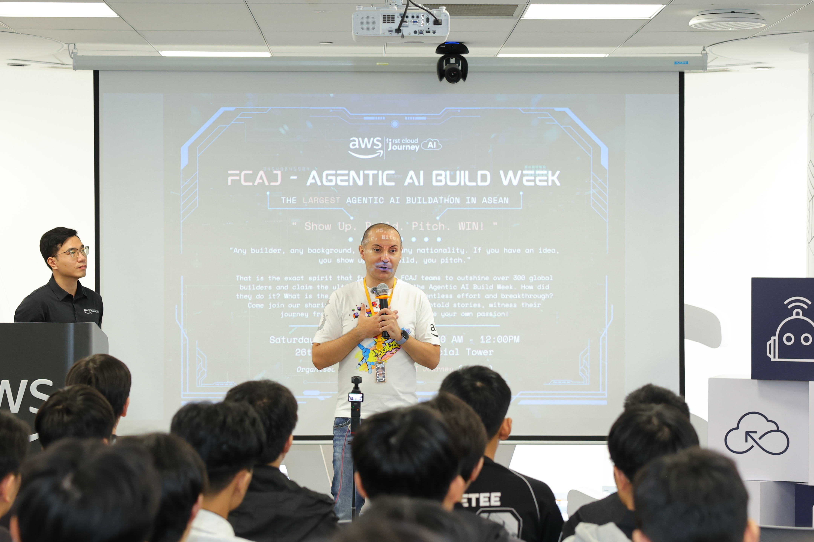

# Event: “FCAJ x Agentic AI Build Week: Show Up. Build. Pitch. WIN!”

### Purpose of the Event
- Created a practical playground (Hackathon) for me and other builders to have the opportunity to get hands-on in building Agentic AI applications that solve real-world problems.
- Encouraged the spirit of "Show Up. Build. Pitch. WIN!" – daring to show up, daring to build, daring to pitch ideas, and pushing personal limits within an extremely short time frame (24-48 hours).
- Provided me with a space for networking, teamwork, and direct learning from AWS Solution Architects and investment funds (like JI Fund).

### List of Speakers & Guests
- **Mr. Joseph Marazota** – Head of Technology of ASEAN, AWS (Inspiring opening speech).
- **Mr. Nguyen Gia Hung** – Head of Solution Architect of Vietnam, AWS.
- Representatives from outstanding competing teams sharing their solutions (One Team, Signal Scout, Team Plan, 3K, Six Pillar).

### Key Highlights

#### Mindset-Shaping Advice from AWS Experts
The event opened with deeply insightful sharing from Mr. Joseph Marazota. I realized that the current generation of young developers has a massive advantage: we aren't bound by tech "legacies" from 20 years ago. Instead of sticking to a "make the system run stable" mindset, we were encouraged to constantly challenge limits, apply AI Agents to automate everything, and become leaders of the tech era in the next 2-3 years.

#### A Feast of Breakthrough AI Agent Ideas from Competing Teams
The brightest spot of the event was the Pitching and Demo session by the teams. I was truly overwhelmed by what they could achieve in just 1-2 days:
- **Multi-channel Ordering Bot Project (One Team):** Solved the pain point of users being too lazy to download apps (App fatigue) by creating an AI Agent to order KFC directly on Zalo/WhatsApp extremely smoothly.
- **Competitor Analysis System (Signal Scout):** Used AI Agents to automatically crawl data, analyze competitors' strategies, and forecast revenue.
- **Automated SA Assistant (Team Plan):** A solution helping Solution Architects automatically draw Architecture Diagrams and generate Terraform/CloudFormation code purely from natural language descriptions.
- **Crowd Monitoring System (Team 3K):** Applied Computer Vision (YOLO) combined with Bedrock Agent to analyze security cameras at airports and supermarkets to coordinate human traffic and avoid congestion.
- **Anti-Money Laundering (AML) (Six Pillar):** Applied Agentic AI to financial operations, automatically reviewing KYC profiles, cross-referencing laws (legal/typology), and minimizing false positives for banks.

#### The Importance of Business Value
A standout point throughout the presentations was: No matter how advanced the technology is, it's meaningless if it doesn't solve the market's "pain points." Drawing a Business Model Canvas and answering the question "Who will use this system?" is just as important as writing code.

### What I Learned

#### Grasped the AWS Services Ecosystem
By analyzing the Architecture of the competing teams, I gathered and systematized how to combine AWS services for real-world problems:
- **Core AI & LLM:** `Amazon Bedrock` (the heart of the Agent system), `Bedrock Guardrails` (controlling hallucination), `Bedrock Knowledge Bases` (for RAG).
- **Compute & Integration:** `AWS Lambda` (flexible logic processing), `AWS Step Functions` (orchestrating Multi-Agent workflows).
- **Data & Streaming:** `Amazon Kinesis Video Streams` (collecting realtime video for AI Vision), `Amazon DynamoDB` (storing metadata and Agent chat history).
- **Security & Front-end:** `AWS WAF`, `Amazon Cognito` (authentication), and `AWS Amplify` (rapid frontend deployment).

#### Design Thinking & AI Risk Management
- I learned how to design a **Human-in-the-loop** architecture (Always having humans at the final step). For example, when Team Six Pillar worked on finance, the AI Agent only synthesized evidence, while the decision to "Escalate" or "Dismiss" remained with a human.
- Using multiple specialized Sub-agents instead of one mother Agent handling all tasks makes debugging easier and increases accuracy.

#### Hackathon "Survival" Skills
- **Scope Control:** Don't be greedy and try to build too many features. Focus on building a Minimum Viable Product (MVP) just enough to live-demo for the Judges. A product on paper will never win.

### How I Will Apply This to My Work
- I will draw motivation from this event to boldly register for a Hackathon in the near future, not prioritizing the prize, but to hone my coding skills under high pressure.
- When implementing my upcoming capstone project, I will apply a clear process: Draft Business Value -> Finalize Scope -> Draw Architecture diagram -> Delegate tasks -> Code and Deploy.
- Experiment with integrating Multi-Agent systems using Amazon Bedrock into personal projects.

### My Practical Experience at the Event

#### Learning from "Laugh-Out-Loud" Stories
The behind-the-scenes sharing from the teams made me feel very empathetic and grounded. From heated arguments due to high egos, taking a walk at 1 AM because the code wouldn't run, staying up until 4-5 AM drinking Redbull, to "self-destructive" moments like accidentally pushing a `.env` file to GitHub or running out of API Tokens right before the pitch. It all painted an incredibly vivid picture of the programming profession.

#### Practical Technical Experience
Witnessing the live demos firsthand (such as AI automatically recognizing and counting people via a camera in real-time) brought me a sense of immense excitement. Seeing the architecture on a slide transform into real running software right on stage infused me with immense inspiration.

#### Networking and Understanding the Value of Teamwork
I realized that in the AI era, no one can learn and do everything alone. The most critical skill isn't being the best coder, but the ability to set aside one's ego, trust teammates, and divide the work (one on frontend, one on architecture design, one on presenting) to strive toward a common goal.

#### Key Takeaway
"Just by daring to start, you have already conquered yourself." The FCAJ x Agentic AI Build Week event didn't just give me knowledge about Cloud or AI, but also handed me the courage to step out of my comfort zone. Technology is always evolving, and the best way not to be left behind is to roll up your sleeves, find like-minded teammates, and start to "Build."

#### Some Pictures Taken at the Event

