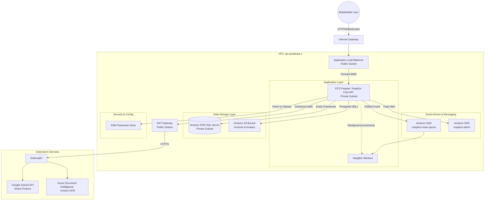

---
title: "System Architecture"
date: 2024-01-01
weight: 1
chapter: false
pre: " <b> 5.1.1. </b> "
---

The Snaptics Multi-Stack network design strictly adheres to security principles: isolating Public and Private tiers, and controlling traffic flow through an Application Load Balancer and specific Security Groups.

### Data Flow Analysis

1. **User Request:** Users call the API or upload invoices via the Mobile App. Requests pass through the `Internet Gateway` and are resolved by the `Application Load Balancer (ALB)`.
2. **Compute Routing:** ALB checks SSL certificates and routes requests to the .NET Containers running on `ECS Fargate` safely located in the Private network.
3. **Data Persistence:** ECS processes business logic, saves physical files to `S3`, and stores financial transactions to `RDS SQL Server`.
4. **Asynchronous Processing:** For time-consuming tasks (e.g., generating monthly financial reports), ECS pushes a message to `SQS`. The `Hangfire Worker` (running concurrently in the same container or cluster) picks up this message to process in the background.
5. **AI Integration:** When invoice reading is required, ECS calls out through the `NAT Gateway` to the Internet to communicate with `Azure Document Intelligence` or `Gemini API`. Extracted data is saved back to RDS.
