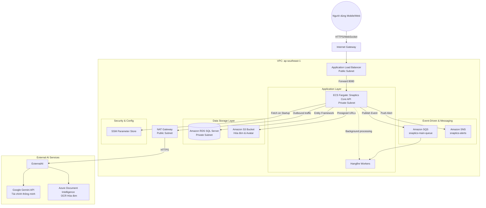

# System Architecture Diagram

Thiết kế mạng Multi-Stack của Snaptics tuân thủ nghiêm ngặt nguyên tắc bảo mật: cô lập hoàn toàn tầng Public và Private, đồng thời kiểm soát luồng truy cập qua Application Load Balancer và các Security Groups đặc thù.

### Phân tích Luồng Hoạt động (Data Flow)

1. **User Request:** Người dùng gọi API hoặc tải hóa đơn lên thông qua Mobile App. Request đi qua `Internet Gateway` và được phân giải bởi `Application Load Balancer (ALB)`.
2. **Compute Routing:** ALB kiểm tra chứng chỉ SSL và định tuyến request vào các Container .NET đang chạy trên `ECS Fargate` nằm an toàn trong mạng Private.
3. **Data Persistance:** ECS xử lý logic kinh doanh, lưu trữ file vật lý lên `S3` và lưu trữ giao dịch tài chính (Transactions) vào `RDS SQL Server`.
4. **Asynchronous Processing:** Nếu có tác vụ tốn thời gian (ví dụ: tạo báo cáo tài chính tháng), ECS đẩy một message vào `SQS`. `Hangfire Worker` (chạy song song trong cùng container hoặc cluster) sẽ bốc message này ra xử lý ngầm.
5. **AI Integration:** Khi cần đọc hóa đơn, ECS gọi qua `NAT Gateway` ra ngoài Internet để giao tiếp với `Azure Document Intelligence` hoặc `Gemini API`. Thông tin trả về được trích xuất và lưu ngược lại vào RDS.
